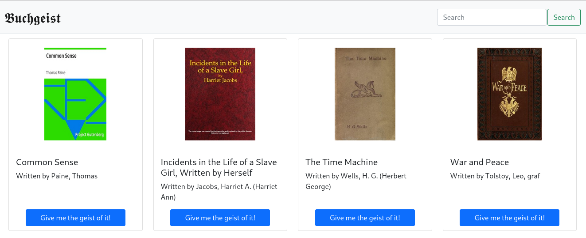

# Buchgeist

#### Video Demo: https://www.youtube.com/watch?v=uBDpIyqnERc

#### Description:




This is CS50, and this is my final project for that course. It is a very simple text
prediction website that generates text via bigrams using books from Gutenberg.
Because the books that are used as input are grabbed *from*
[Gutenberg](https://gutenberg.org) additional steps need to be taken since
they prohibit crawling:

1. A database needs to be constructed according to their
   [policy](https://www.gutenberg.org/policy/robot_access.html).
2. Images are downloaded using `wget` so that searches won't be painfully slow.
   The full download was about ~900mb, so not too bad.
3. Then books can be downloaded on a query to query basis.

The website is very simple, and is really only constitued by three locations:

1. **Homepage**: 20 randomly chosen books from Gutenbergs' most popular in the
   last 30 days.
2. **Search**: search in SQL database (which looks very similar to homepage)
3. **Book**: view of a random prediction for 10 sentences using bigram model.

Since the generation of bigram models is much simpler than say GPT-2 or any
transformer model, as long as you stick to the shorter books, the site actually
becomes quite responsive (< 10s per book). Now, the prediction results aren't
*great*, but they work for their intended purpose. Which is to say, just for
fun.


### Requirements

- `redis-server`
- `rqworker`

## Instructions

```
pip3 install -r requirements.txt
```

```python
import nltk
nltk.download('punkt')
```

For documentation regarding generating database from RDF-files, as well as
downloading the actual cover images, use `pydoc3 build_db`.

## Documentation

```
app.py
    Contains flask application. It also handles the redis queue actions, as well
    as the operation in randomly selecting the cards for the homepage.

helpers.py
    Contains helper function for flask applications:

    Functions:
        generate_most_popular():
            Creates a JSON file of most 'title: author' for all titles on
            Gutenbergs "Most popular in the last 30 days". This is performed via
            BeautifulSoup as well as regex.

        generate_cards():
            Generates a JSON file of 'title, author, img' for each title in JSON
            file generated from 'generate_most_popular'. This is then used in
            flask to generate homepage.

        cleanbook():
            Returns a downloaded book from Gutenberg, stripped of its license
            headers. Performed using the 'gutenbergpy' package

        generate_sentences():
            Returns a list of ten sentences generated through the BookModel's
            predict method, using weighted probability.

bookmodel.py
    Contains the BookModel class

    Classes:
        BookModel:
            Stores the relevant variables/methods for book. This is exported to
            JSON file so that it is persistent across program reboots

            Class variables:
                book_raw = book in one long string. Only used for
                    initializing the object the first time, otherwise None.
                bigrams = all bigrams in book
                first_words = Counter object of all the first words in sentences
                weights = The weights for first words as extracted from the 
                    first_words Counter

            Methods:
                extract_bigrams(self, book):
                    Extracts all bigrams from book. The tokenizer used is from
                    NLTK.
                predict(self, word):
                    Predicts next word using weighted probality from generated
                    BookModel.
                get_first_words(self):
                    Extracts first word from sentences, returning a Counter
                    (which also contains the weights for those first words, to
                    be used in deciding which word is the first word in randomly
                    generated text).

    Functions:
        generate_bookmodel(book_id):
            Returns generated BookModel object. This function only needs to
            exist for redis purposes, seeing as I can only pass in a function
            there.

build_db.py:
    Contains functions related to the download/creation of database and image
    covers.

    Functions:
        build_database(rdf_dir="rdf-files/cache/epub"):
            Builds SQL database from catalog of RDF-files. Performed by going
            through each RDF file and extracting the relevant fields (title,
            author, book_id) and injecting those into the SQL database if not
            already present.

        download_covers(db="metadata.db"):
            Downloads covers for books in SQL database, using a Gutenberg
            mirror. Smaller cover size is used to alleviate stress on server.
            Performed using wget.
```
